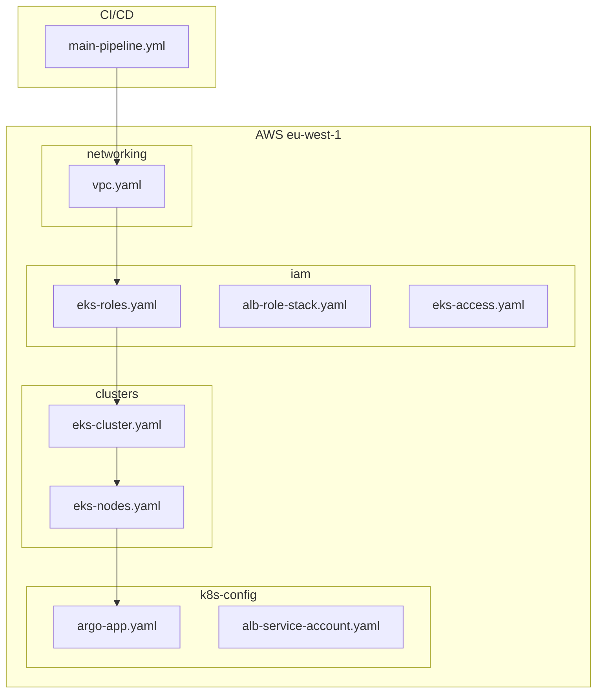

# AuraScale Infrastructure Core 🚀

A production-grade, automated EKS (Elastic Kubernetes Service) environment built with **AWS CloudFormation** and **GitHub Actions**. This repository manages the foundational "Platform Layer" for AuraScale.

## 🏗️ Architecture Overview

The infrastructure follows a strictly decoupled, layered approach to ensure high availability and security.


## 📂 Project Structure

| Folder | Description | Key Files |
| :--- | :--- | :--- |
| `.github/` | CI/CD Automation | `main-pipeline.yml` |
| `networking/` | Core Network Layer | `vpc.yaml` |
| `iam/` | Identity & Access | `eks-roles.yaml`, `eks-access.yaml`, `alb-role-stack.yaml` |
| `clusters/` | Kubernetes Engine | `eks-cluster.yaml`, `eks-nodes.yaml` |
| `k8s-config/` | Cluster Runtime | `argo-app.yaml`, `alb-service-account.yaml` |

## 🚀 Deployment Workflow

The infrastructure deployment follows a strict dependency order:
1. **Networking**: Provisions the VPC, Subnets, and NAT Gateways.
2. **IAM**: Sets up the OIDC Provider and execution roles.
3. **Clusters**: Deploys the EKS Control Plane (v1.31).
4. **Nodes**: Attaches Managed Node Groups to the cluster.
5. **K8s Config**: Bootstraps Access Entries and Service Accounts.

## 🛠️ Getting Started

### Prerequisites
- **AWS CLI** configured with `AdministratorAccess`.
- **kubectl** and **helm** installed locally.

## 🚀 Quick Start: Deployment Guide

### 1. Clone the Repository
```bash
git clone [https://github.com/Oluwa-feranmi/aurascale-infra-core.git]
cd aurascale-infra-core
```
-- While the GitHub Action automates this on every push, you can deploy the stacks manually using the AWS CLI if needed --

### 2. Local Cluster Connection
Run the following to map your local environment to the cloud:
```bash
aws eks update-kubeconfig --region eu-west-1 --name aurascale-control-plane
```
### 3. Check node status
```bash
kubectl get nodes
```
### 4. Check system health
```bash
kubectl get pods -n kube-system
```
### 5. Bootstrap ArgoCD (GitOps)
Once the infrastructure is live, deploy the ArgoCD parent application to manage workloads:
```bash
kubectl apply -f k8s-config/argo-app.yaml
```
## 🔐 Security Standards
Private Compute: All worker nodes are isolated in private subnets.

OIDC Integration: Implements IAM Roles for Service Accounts (IRSA) for fine-grained security.

Access Entries: Modern RBAC management via the ``` iam/eks-access.yaml stack.```

Built with 💡 by the AuraScale Platform Team.
